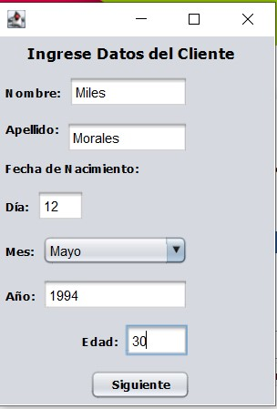

# StrategyExample
Example of the design pattern Strategy.

This example presents the use of the strategy pattern simulating the interface of a supermarket, where there are several types of discounts depending on the age of the customers, whether they are adults or young people. 

First, the customer's data must be registered.

And then you can choose the type of customer to apply the corresponding discount and the total value of the purchase. Then it will indicate the total value, the discount, and the final value after applying the discount.

